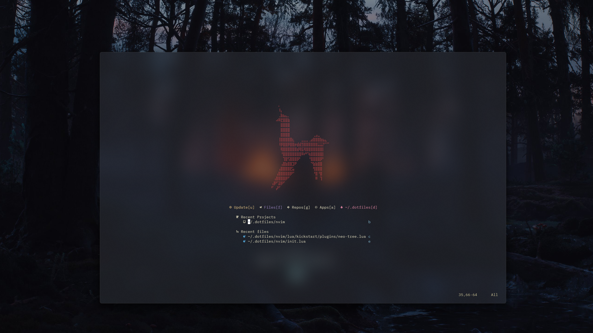

# Personal dotfiles

<!--toc:start-->

- [Personal dotfiles](#personal-dotfiles)
  - [About](#about)
  - [For](#for)
  - [How](#how)
    - [Neovim](#neovim)
    - [Starship](#starship)
    - [Other](#other)
  - [Screenshots](#screenshots)

<!--toc:end-->

## About

- Personal config files for multiple tools: linux dev env mostly.
- Neovim configuration and Arch initial setup scripts (time savers),
- nvim + plugins, zsh, starship, node, ssh client, c++ tools, brew, etc...
  - Contains some aliases.
  - Contains some starship config.

## For

Minimal Arch setup with no GUI.

## How

Clone and install whatever you want.

```sh
git clone https://github.com/KeaCluster/dotfiles.git ~/.dotfiles
```

You can add execution permission to these scripts with:

```sh
chmod u+x ~/.dotfiles/scripts/init.sh
```

You might need to sudo-it

```sh
sudo chmod 700 ~/.dotfiles/scripts/init.sh
```

Then `cd` into `scripts` or do it from any directory

```sh
cd ~/.dotfiles/scripts/ && sh init.sh
```

or just run the files.

```sh
sh ~/.dotfiles/scripts/init.sh
```

This script will install basic programs as well as add some system links

If you already have some configuration and would like to test mine,
you can just update system links to match this repo's files with:

```sh
sh sys_links.sh
```

- NOTE:

This might make a backup of your previous configuration if it exists,
but I would recommend making that on your own.

- Verify your installation with the script's instructions.

### Neovim

> [!IMPORTANT]
> This was the prev used file in order to install neovim.
> You can now install it from the AUR (I recommend that).

```sh
sh nvim_setup.sh
```

This will install neovim and set it as default editor.

> [!IMPORTANT]
> Migration from lazyvim is currently underway.
> To continue using Lazyvim check the following [commit](https://github.com/KeaCluster/dotfiles/tree/5bd2730e5f91d966f1fd1933e7c73fba8275830d) and continue bellow

If already installed and would like to use my personal configuration,
you can run the following individually::

```sh
sh lazyvim_setup.sh
```

If neither are installed, run them both.

### Starship

I switched from oh-my-zsh to starship as my command shell prompt.

If you're using starship, and want to use my setup:
Uncomment this line from `sys_links.sh`:

```sh
create_link "$DOTFILES_DIR/bash/pure-preset.toml" "$TARGET_DIR/.config/starship.toml"
```

If running `init.sh`:
it will instal starship and apply my modified pure theme to it.
(kanagawa-ish colors + couple of icons)

### Other

There's a script to update arch' gpg keys because I'm lazy.

## Screenshots




