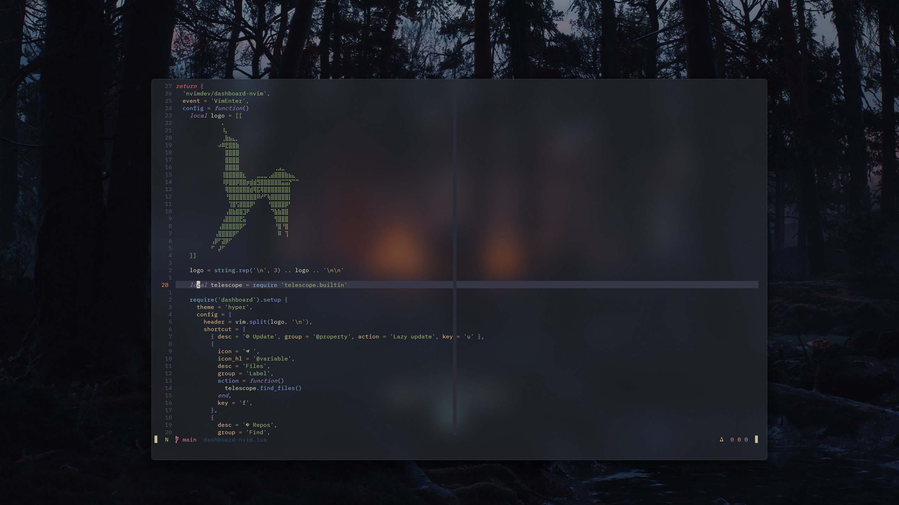

# Personal dotfiles

<!-- toc -->

- [About](#about)
- [For](#for)
- [How](#how)
  - [Nvim config is separate due to version constraints](#nvim-config-is-separate-due-to-version-constraints)
  - [Minimal theme](#minimal-theme)
- [Screenshots](#screenshots)

<!-- tocstop -->

## About

- QA non-compliant
- Not recommended
- Mere experiment
- nvim, git, zsh, node, ssh, c++ tools, brew, etc...

## For

Minimal Debian setup (No GUI config)

## How

```sh
git clone https://github.com/KeaCluster/dotfiles.git ~/.dotfiles
```

You can add execution permition to these scripts with:

```sh
chmod u+x ~/.dotfiles/scripts/init.sh
```

Then `cd` into `scripts` or do it from any directory

```sh
cd ~/.dotfiles/scripts/
```

or just run the files.

```sh
~/.dotfiles/scripts/init.sh
```

This script will install basic programs as well as add some system links

If you already have some config, you can just update system links to match this repo's files with:

```sh
sys_links.sh
```

- NOTE:

This won't make backups of your previous config.

- Verify your installation with the script's instructions.

### Nvim config is separate due to version constraints

```sh
nvim_setup.sh
```

### Minimal theme

With the use of Zsh and OhMyZsh its optional to install this theme (I like it)

```sh
minimal_theme_setup.sh
```

## Screenshots



